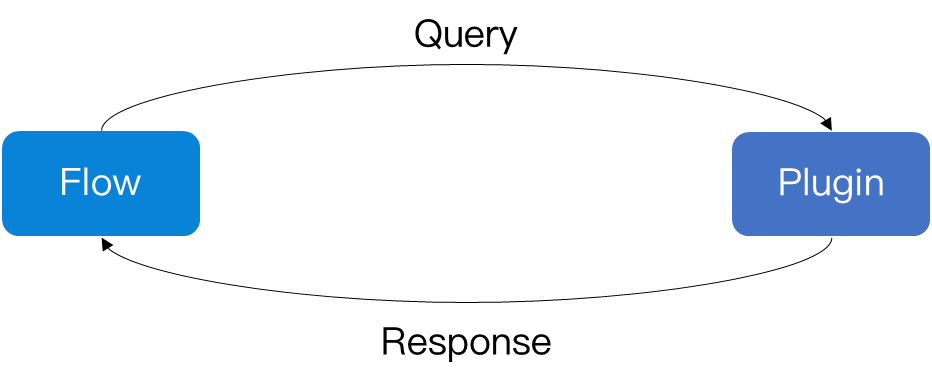

# Flow.Launcher.JsonRPC.Python

[](https://pypi.org/project/flowlauncher/)
[](https://pypi.org/project/flowlauncher/)

Flow Launcher supports Python by JsonRPC.

## JSON-RPC

> [JSON-RPC](https://en.wikipedia.org/wiki/JSON-RPC) is a remote procedure call protocol encoded in JSON.

In Flow Launcher, we use JSON-RPC as a **local** procedure call protocol to bind Flow and other program languages.

So we need to build a **common API** between Flow and Plugin.



### Example

- `-->` denotes data sent to FLow.
- `<--` denotes data coming from Flow.

```json
--> {"method": "query", "parameters": [""]}
<-- {"Title": "title", "SubTitle": "sub title", "IconPath": "favicon.ico"}
```

<!-- TODO: try to add some other examples -->

## Installation

### Using `pip`

``` bash
>>> pip install flowlauncher
```

### Using `pip` + `git`

``` bash
>>> pip install git+https://github.com/Flow-Launcher/Flow.Launcher.JsonRPC.Python.git
```

### Using `git`

``` bash
>>> git clone https://github.com/Flow-Launcher/Flow.Launcher.JsonRPC.Python.git
>>> cd Flow.Launcher.JsonRPC.Python
>>> python setup.py install
```

<!-- TODO: update Example Plugin (HellowWorldPython) for this plugin -->

### License

This project is under the [MIT](./LICENSE) license.

Some of the orignal codes from [JsonRPC/wox.py](https://github.com/Wox-launcher/Wox/blob/master/JsonRPC/wox.py) which is under the [MIT](https://github.com/Wox-launcher/Wox/blob/master/LICENSE) license.
